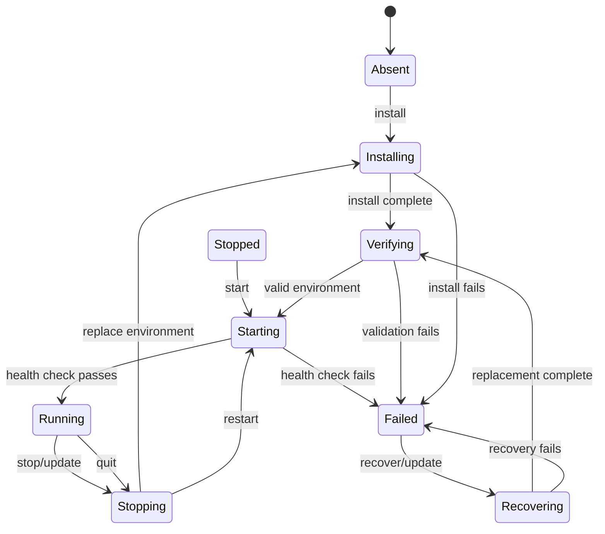

# Install and Startup Reliability Proposal

## Goal

Make the desktop backend reliably reach one of two understandable states on
every supported machine:

1. **Running** — the server passed its health check and the UI can use it.
2. **Actionable failure** — installation, recovery, or startup failed with a
   durable diagnostic and a safe retry action.

The first priority is correctness across cold machines, interrupted installs,
offline launches, upgrades, and concurrent UI actions. Reducing complexity is
the means to that end.

## Current shape

The product has strong ingredients: a managed Python runtime, source-aware
installs, health checks, rollback, diagnostics, per-user ports, and orphan
cleanup. The risk is that lifecycle ownership is spread across the installer,
IPC handlers, boot logic, recovery, and updater. Each can initiate some part
of start/stop/reinstall work.

That makes the happy path resilient, but leaves timing behavior hard to reason
about. In particular, replacing a `uv tool` environment is not safe if another
path can start the process during source inspection, the replacement, or
rollback.

## Target model

One `ServerLifecycle` service owns all process and environment transitions.
Callers request an intent; they do not directly combine `startServer`,
`stopServer`, and `uv tool install` themselves.

The service serializes each entire transition. A replacement transaction begins
before any source inspection, includes stop/install/verification/restart and
rollback, and only then releases the queue. This prevents a start from seeing a
partially rewritten environment.

## Design rules

- **One public entry point per intent.** `ensureRunning`, `stop`, `install`,
  `recover`, and `update` are lifecycle operations. IPC, boot, and onboarding
  call these operations rather than process helpers directly.
- **One queue, re-entrant for compound work.** A start waits behind an update;
  an update can safely stop and restart within its own transaction.
- **Per-attempt diagnostics.** Clear/capture logs at the beginning of every
  start attempt. Recovery decisions inspect only that attempt's terminal error.
- **Structured recovery reasons.** Prefer a small server-emitted failure code
  or a parsed terminal exception category over broad log substring matching.
  Categories should include missing dependency, unsupported Python, migration,
  configuration, port conflict, and unknown.
- **Safe replacement.** Keep the known-good version/source before replacement;
  validate the new environment and restart it before reporting success. When
  feasible, build in a temporary environment and atomically switch rather than
  mutating the live environment in place.
- **Bounded operations.** Every network, subprocess, health, and lock wait has
  a timeout, cancellation behavior, and an observable error.
- **Idempotent intents.** Repeating `ensureRunning` returns the same running
  result; repeating `recover` does not create overlapping reinstalls.

## Proposed delivery plan

### Phase 1 — make current behavior safe

- Keep the shared lifecycle queue around all existing start, stop, installer,
  repair, update, rollback, and verification transitions.
- Record diagnostics per start attempt and classify only the current failure.
- Add race tests for start-vs-reinstall, start-vs-update, and stop-vs-start.

### Phase 2 — simplify ownership

- Introduce a `ServerLifecycle` facade with the five public intents above.
- Move orchestration from `index.ts`, `installer.ts`, and `server-updater.ts`
  into that facade; leave those modules as UI/IPC adapters.
- Return a typed lifecycle result containing state, retryability, user-facing
  message, technical reason, and log path.

### Phase 3 — strengthen installation and release confidence

- Replace heuristic-only repair decisions with structured failure categories.
- Evaluate staged/atomic venv replacement, with an explicit Windows fallback.
- Persist a small transaction journal so a launch after interruption can detect
  and repair an incomplete replacement deterministically.

## Required validation matrix

These should become automated platform smoke tests, not just manual checks:

| Scenario | macOS | Windows | Expected result |
|---|---:|---:|---|
| Clean profile, online | Yes | Yes | Installs managed Python/server and reaches healthy state |
| Clean profile, offline | Yes | Yes | Shows actionable offline setup state; does not corrupt state |
| Normal relaunch | Yes | Yes | Reuses or adopts only its own healthy server |
| Interrupted replacement | Yes | Yes | Next launch recovers or reports one durable actionable failure |
| Corrupt dependency | Yes | Yes | One serialized repair attempt, then health check |
| Unsupported old Python venv | Yes | Yes | Recreates on supported managed Python |
| Port conflict/orphan | Yes | Yes | Avoids foreign process; reaps only safe orphan cases |
| Concurrent restart and update | Yes | Yes | No server spawn while the environment is being rewritten |
| Preview/stable/prod separation | Yes | Yes | No shared database, port, or token state across build kinds |

The current unit suite is useful for pure decisions, but this matrix needs real
Electron/package smoke coverage on macOS and Windows. It should include a
temporary user-data and `uv` home so it tests the same first-run conditions
users see.

## Success criteria

- No lifecycle transition writes the tool environment while a server start is
  in progress.
- Every failed startup reports a current-attempt diagnostic and a stable retry
  outcome.
- A clean install and a restart are continuously smoke-tested on macOS and
  Windows.
- The UI has one source of truth for lifecycle state instead of inferring it
  from several independent process calls.
