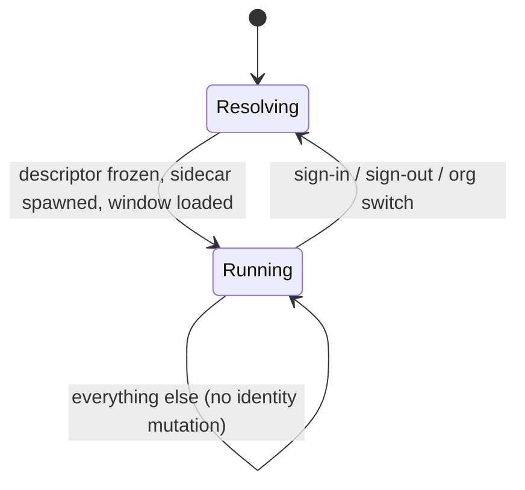

# Session identity — the invariant, and the shape we want

*A north star for how the desktop app decides which account and organization it is
operating as, and how that decision reaches the sidecar and the window.*

**Status:** draft for team review · **Owner:** _(add name)_ · **Last updated:** 2026-09-21

> How to use this doc: it is the reference for changes to the account/organization
> data-root machinery in `src/main`. It states one invariant, describes the model we
> are converging toward, and gives a staged path. Propose changes inline. It is not a
> record of a decision already taken.

---

## 1. The invariant

**The sidecar, the shell and the window must agree on who is signed in.**

Account isolation rests entirely on that agreement. When it holds, one account's tasks,
files, vault, memory and skills are unreachable from another. When it breaks, the app
either shows the wrong account's data or refuses to work at all.

## 2. What is true today

ENG-548 gave each MindsHub account its own
data root. It meets the isolation requirement. It maintains the invariant by **ordered
writes and compensating rollbacks across many mutable places**, rather than by
construction.

The identity of a session currently lives in:

| Where | What |
| --- | --- |
| 6 files on disk | `.account`, `.organization`, `active-account.json`, `active-org.json`, `.pre-existing-data`, `.ownership-settled` (`src/main/account-data.ts`) |
| 16 module-level variables in main | across `account-data.ts`, `server-process.ts`, `server-auth.ts`, `token-store.ts` — including two in-memory quarantine flags that exist because the on-disk records can fail to write |
| The renderer | account-keyed `localStorage`, correct only after a document reload |

Roughly 25 non-test call sites re-resolve the root while the app runs, 17 of them in
`server-process.ts`. Three separate sequences reconcile the sidecar against the current
resolution and roll back on failure (`app.ts:186`, `app.ts:1130`, `minds-auth.ts:1947`).

Every one of those sites is individually well-reasoned. The cost is that correctness
depends on all of them continuing to agree.

## 3. Why the shape produces incidents

Two examples, both already in the code.

**A drift the code names itself.** `writeActiveOrgSync` throws rather than failing
quietly, because a lost write would leave the record naming the previous organization —
then `sidecarIsOnCurrentStores()` "would compare two stale values, agree, skip the
restart, and report a successful switch while the sidecar still served the previous
organization's database" (`account-data.ts:629`). The hazard is understood. Nothing
prevents it. One function is careful on its behalf.

**A drift that shipped.** `getServerAuthToken()` resolves the loopback bearer token
through `accountDataRoot()`, which re-reads the account record on every call. The
sidecar's root is pinned at spawn in `_runningAccountRoot`. When the two disagree, the
shell sends a token the sidecar refuses and **every** authenticated call returns 401 for
the life of the process. `/health` is auth-exempt, so the app looks up. See the appendix
for a captured instance.

**Nothing treats a 401 from the loopback sidecar as a signal.** The only code that
knows this state exists is `probeAuthMismatch` in the server updater
(`server-updater.ts:694`), and its remedy is to roll back the server version.

## 4. The model: identity is immutable per generation

Resolve `(account, organization)` **once**, before the sidecar spawns and before the
window loads. Freeze it into one descriptor:

```ts
interface Session {
  readonly accountId: string | null;
  readonly organizationId: string | null;
  readonly root: string;           // account data root
  readonly storePaths: StorePaths; // db, projects, files, vault, memory, skills, streams
  readonly loopbackToken: string;  // minted here, handed to the sidecar at spawn
}
```

Everything downstream takes that value. `accountDataRoot()` stops being a function that
re-reads the disk and becomes `session.root`.

**An identity change creates a new generation.** One code path tears down the sidecar and
the document, then builds both from a new descriptor. Nothing mutates in place.

That single rule removes the ordering problem. If the new generation cannot be built, the
old one was never touched — keep it running and report the failure. The compensating
rollback ladders have nothing left to compensate for.



## 5. What the model deletes

- `sidecarIsOnCurrentStores()` and `ensureSidecarOnCurrentAccountRoot()`, and their call
  sites — nothing can drift, so nothing needs reconciling.
- The rollback ladders in `switchMindsOrg` (`minds-auth.ts:1803`), which today
  compensate step by step across five stores and choose between two recovery calls
  depending on which shape the failure left behind.
- The bearer-token cache and its invalidation sites (see step 1 below).
- The renderer's "was this document built for this account?" reasoning. A generation is
  always a new document.

## 6. Direction rule

Until the model lands, every change in this area must **remove a mutable identity
variable, and must not add a reconcile point.** A fix that adds one more place to keep in
agreement is the pattern this doc exists to stop.

## 7. Staged path

Each step is independently shippable and useful on its own.

**Step 1 — Mint the loopback token in main and pass it at spawn.** The sidecar already
prefers an injected token: `token = settings.auth_token or ensure_auth_token(env_path)`
(`cowork-server/cowork/server.py:286`), reading `COWORK_AUTH_TOKEN` from its environment.
The desktop passes everything but that, so the token round-trips through a `.env` file
that both processes read-modify-write (`auth_middleware.py:113` truncates and rewrites;
`minds-auth.ts:1446` writes and renames). Injecting it at spawn gives the file one writer,
deletes the cache and its invalidation sites, and closes the 401 class.

**Step 2 — Capture the descriptor once per generation.** Build `Session` at the point the
sidecar is spawned. Replace dynamic `accountDataRoot()` / `readActiveAccount()` reads with
reads of the descriptor. This is mechanical and leaves behavior unchanged. It makes drift
representable only at generation boundaries.

**Step 3 — Make a generation swap the only way identity changes.** Route sign-in, sign-out
and organization switch through one teardown-and-rebuild path. Delete the reconcile and
rollback code they replace.

**Step 4 — Move the ownership machinery out of the steady-state path.** `.pre-existing-data`,
`.ownership-settled`, incumbent adoption, quarantine roots and the stale-root sweep answer
a one-time question: whose is the data that predates per-account roots? It is answered once
per install but runs on every boot. Answer it in an upgrade step, then delete it from the
runtime path.

## 8. Constraints

- The isolation guarantee ENG-548 established does not weaken. Unproven ownership still
  resolves away from the default root, never onto it.
- No data moves. An existing single-account install keeps its root exactly where it is.
- A generation swap is visible to the user as a reload. It must not cost unsent work.

## 9. Open questions

- Where does the descriptor live so main, the sidecar spawn and the preload all read one
  copy?
- Does a generation swap need to survive a failed sidecar start, or is "keep the old
  generation and report" enough in every case?
- Step 4 changes upgrade behavior for installs that predate per-account roots. Which
  installs are still in that state, and does the migration need a UI?

## Appendix — a captured instance

Desktop prod, 2026-09-21, first launch after the release. Every authenticated call failed
for the whole process; `/health` answered normally because it is auth-exempt. A page
refresh did not help, because the token cache lives in main. Quitting and relaunching did.

```
PUT /api/v1/runtime-credential/minds      401 Unauthorized
PUT /api/v1/settings/minds_url            401 Unauthorized
PUT /api/v1/settings/planning_provider    401 Unauthorized
GET /api/v1/settings/recommended-models   401 Unauthorized
GET /api/v1/health/                       200 OK
```

The user-visible symptom was "Could not save your settings to the server" on the
onboarding screen. The settings write was never the problem.
